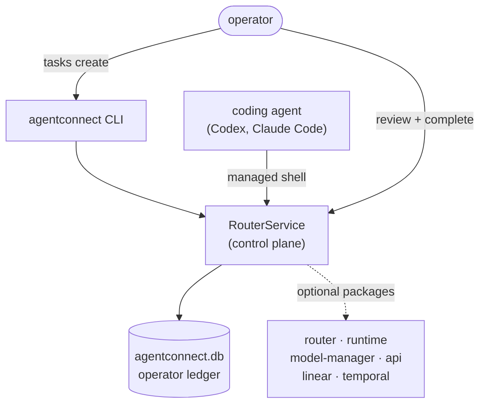
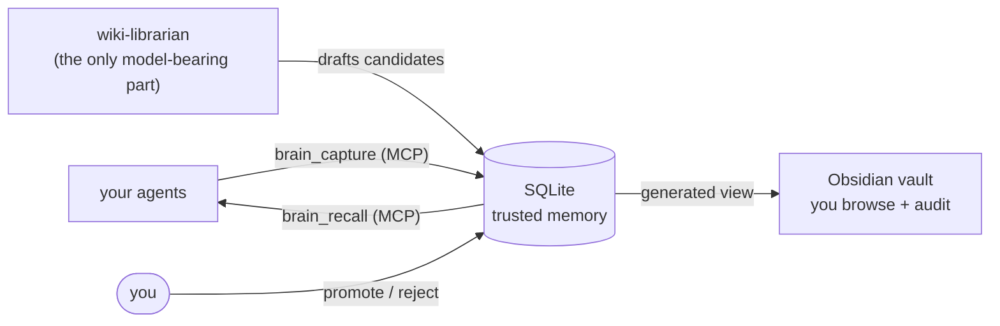
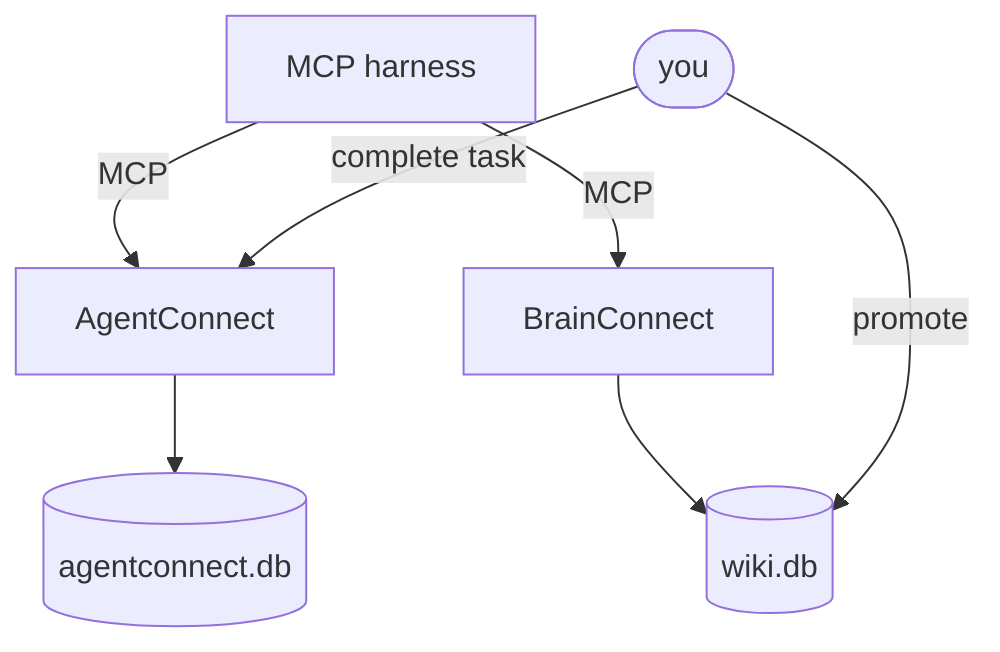
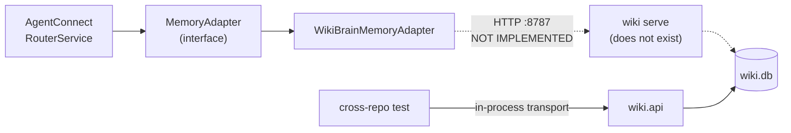
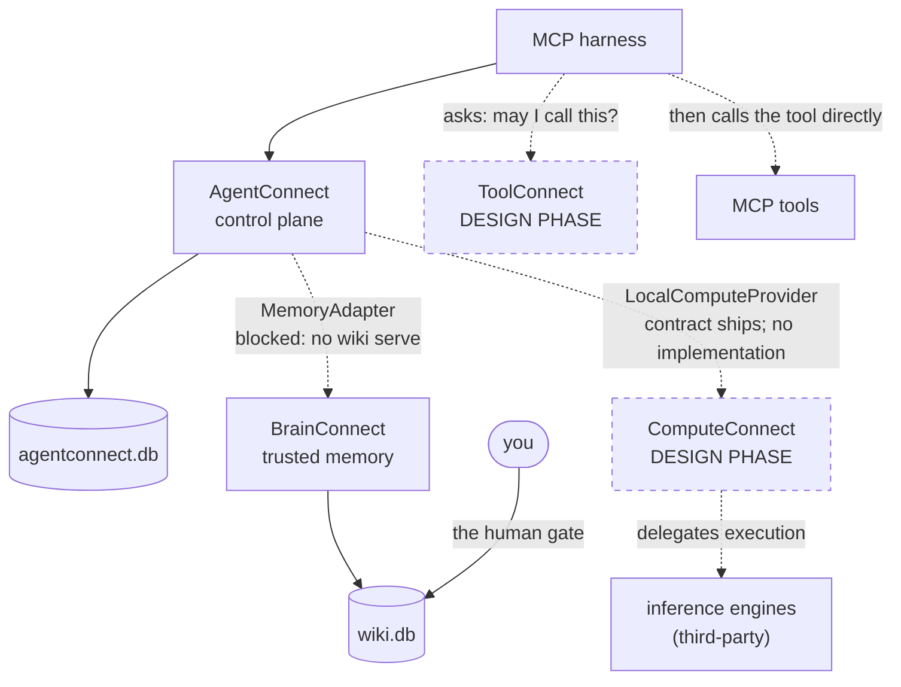

# Architecture

How the Connect products interact. Diagrams are rendered with Mermaid.

Throughout, **solid arrows are paths that exist in code today.** Dashed arrows are contracts
that are defined but not implemented, or designs that have not been built. That distinction
is load-bearing; if you read only one thing on this page, read
[the ecosystem diagram's caveat](#complete-ecosystem-deployment).

---

## The pieces

| Product | Owns | Delegates | Status |
|---|---|---|---|
| **AgentConnect** | Task/artifact/decision/review/handoff ledger, routing, model tiering, worker runtime, workspaces and scoped tokens, audit. Both cross-product contracts. | Durable workflows to Temporal, issues to Linear, protocol to the official MCP SDK, inference to whatever implements `LocalComputeProvider` | Implemented |
| **BrainConnect** | Trust, provenance, scope, promotion and supersession of claims. The human gate. | Search sophistication to a pluggable retrieval backend; secret and injection detection to third-party engines | Implemented |
| **ComputeConnect** | *Charter:* compute-provider registry, runtime and model lifecycle delegation, placement policy, health, execution metadata | Inference itself — it never loads a tensor | Design phase, no runtime |
| **ToolConnect** | *Charter:* protocol-neutral tool registry, asserted governance metadata, policy decisions, health, authorization records, audit | Tool description and transport to MCP; in-path proxying to existing gateways | Design phase, no runtime |

The division is deliberate. **AgentConnect controls access; BrainConnect controls trust.**
Neither is allowed to do the other's job. A task reaching `complete` in AgentConnect never
promotes a claim in BrainConnect, and no BrainConnect status ever authorises an agent to act.

The same discipline governs the design-phase products. **ComputeConnect decides where work
runs, not how it is computed.** **ToolConnect decides whether a call is permitted, and does
not carry the call.**

### The contracts

Cross-product surface is expressed as an interface in `agentconnect-core`, never as shared
code:

- **`MemoryAdapter`** — how the control plane reaches a memory layer. `WikiBrainMemoryAdapter`
  is one implementation, registered in `agentconnect.core.bootstrap` against the
  `WIKIBRAIN_URL` environment variable with a default of `http://localhost:8787`.
- **`LocalComputeProvider`** — an abstract base in `agentconnect.core.local_compute`, with
  `HttpLocalComputeProvider` as the shipped implementation. AgentConnect declares what local
  inference must look like and does not own the engine behind it. ComputeConnect's charter is
  to be the engine-side manager conforming to this contract.

There is no contract for tool governance. ToolConnect's architecture defines its own
interfaces, and its `docs/STATUS.md` is explicit that they are illustrative signatures rather
than committed APIs.

There is no shared package and no monorepo. Separate repositories, explicit interfaces.

---

## Standalone deployments

Every product is designed standalone-first. The two implemented ones are complete on their
own today.

### AgentConnect alone

The agent works inside its own harness, but durable work must enter the ledger. A managed
agent session **cannot complete its own task** — the operator closes the loop. This is what
makes the record defensible.

**Boundary:** AgentConnect is a compliance and control layer, *not* a security sandbox. It
records what a cooperative agent did. It does not contain a hostile one.

**Open issue:** the HTTP API (`agentconnect-api`) currently has an authorization and
completion bypass. The CLI path drawn above is unaffected. Do not expose the HTTP API to
managed agents until it is fixed. See [COMPATIBILITY.md](COMPATIBILITY.md#known-gaps).

### BrainConnect alone

Everything captured — by an agent or by you — lands `pending`. It becomes trusted memory only
when a human promotes it. The `wiki` command itself makes zero model calls; only the separate
`wiki-librarian` process uses a model, and only to draft.

**Retrieval can never widen trust.** The search backend nominates rows by id; the ledger
answers for status, scope, and confidence. Swap a vector store in underneath and the trust
boundary does not move.

---

## Two-product integration

### Topology A — harness-mediated ✅ exists today

Two independent MCP servers; the harness is the only component touching both. No HTTP, no
shared port, no integration code. The agent is *able* to record a finding in memory and *able*
to record work in the ledger, but nothing couples the two.

### Topology B — adapter-mediated ⛔ contract defined, server missing

The adapter, the environment variable, and the default URL all exist. The server does not.
BrainConnect contains no HTTP framework of any kind, and `wiki serve` is a tracked, deferred
follow-up.

The cross-repo integration test substitutes an in-process transport into `wiki.api`. It
exercises a real ledger, real promotion, and the real trust filter — so the *semantics* are
verified. The wire is not.

> A green integration suite means the semantics agree, not that the network path exists.

### The intended trust gradient

When Topology B lands, the flow is one-way and asymmetric by design:

- **Capture is write-only.** Workers — including low-tier or remote ones — may contribute
  findings. Sending data they already hold leaks nothing.
- **Recall is manager-only.** A worker can add to memory and can never read privileged memory
  back out.
- **Re-injection is mediated.** Recalled context flows down into subtasks only through
  AgentConnect's existing classify-and-redact pass.

This gets durable cross-task memory without inventing a trust tier inside BrainConnect. The
topology does the work.

**The rule every consumer must obey:** `trusted: true` is the authority signal.
`status: "promoted"` is **not**. A promoted claim sitting in an open contradiction comes back
`promoted` *and* untrusted. A missing `trusted` means untrusted — never infer it from status.

Independently: **trusted is not the same as safe to expose.** Promotion decides authority; it
says nothing about whether the text carries an API key. Safety engines mask, withhold, and
flag. No safety engine and no safety policy may ever *set* `trusted` — safety subtracts, it
never vouches.

---

## Complete ecosystem deployment

**This diagram describes a system that does not exist.** Two of its four products have no
runtime, and the one implemented cross-product link is the blocked Topology B above. It shows
where the seams fall given the interfaces and charters that exist today. Nothing here is a
commitment, and no part of it is installable.

What can honestly be said about each dashed edge:

- **AgentConnect → BrainConnect.** The interface exists and its semantics are tested. It needs
  an HTTP server on the BrainConnect side. This is the nearest thing to real.
- **AgentConnect → ComputeConnect.** `LocalComputeProvider` and `HttpLocalComputeProvider`
  ship in `agentconnect-core` today. ComputeConnect's charter is to be the engine-side manager
  conforming to that contract. No implementation exists, and its architecture proposal has not
  yet been pushed to its repository.
- **Harness → ToolConnect.** Note the shape: the decision arrow and the call arrow are
  *separate*. ToolConnect answers whether a call is permitted; the caller then invokes the
  tool itself. ToolConnect is never in the data path. Drawing it inline would misrepresent the
  architecture, which explicitly rejects the proxy role.

The dashed arrows become solid only when something runs.
