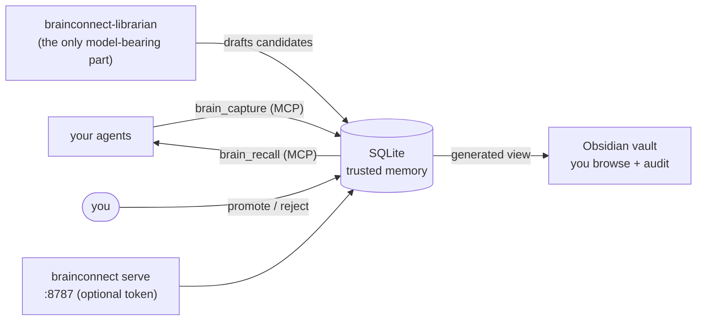
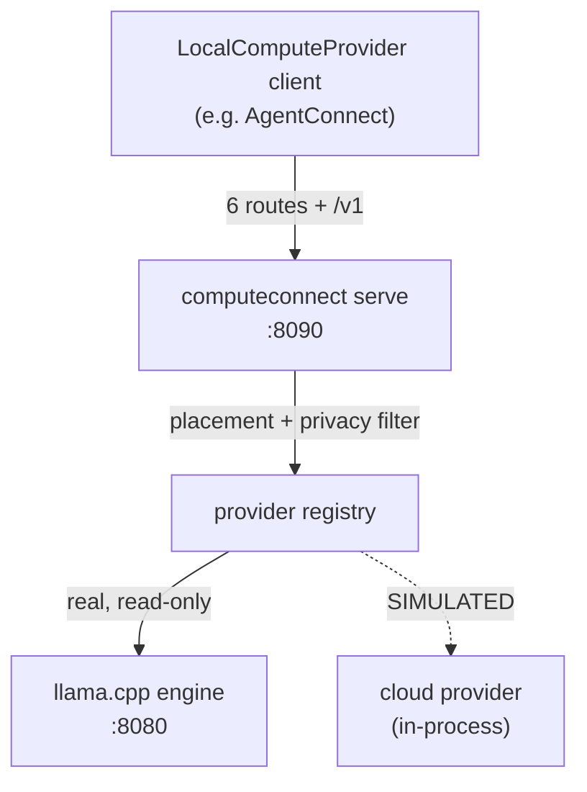
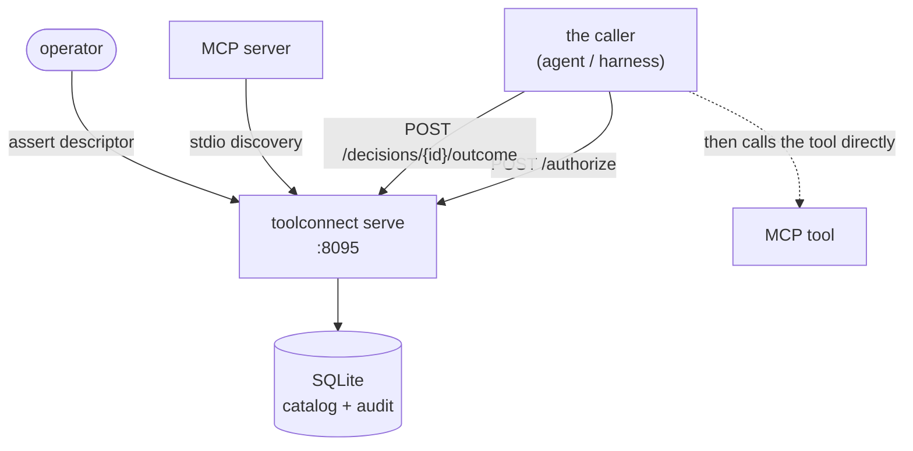
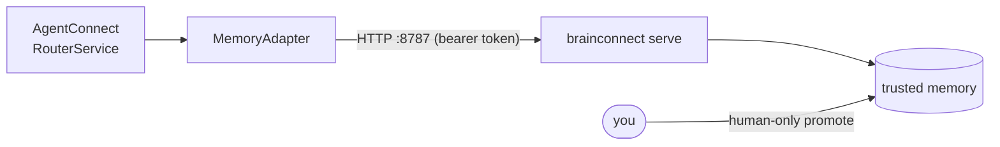
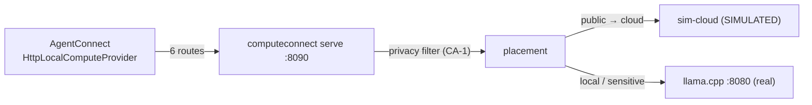
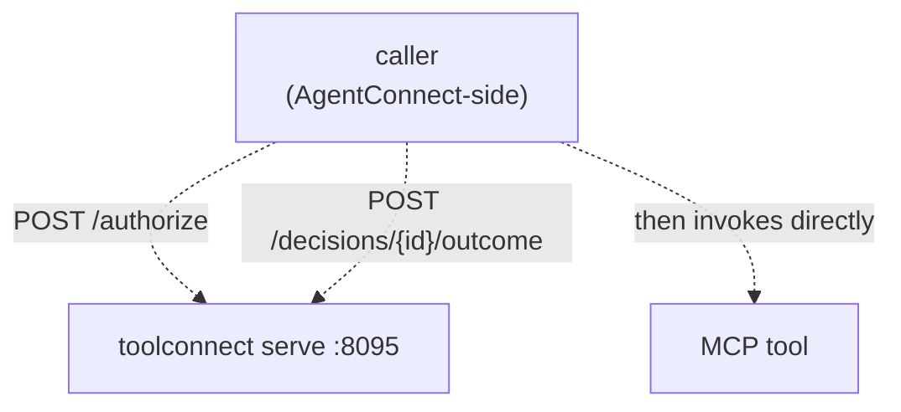
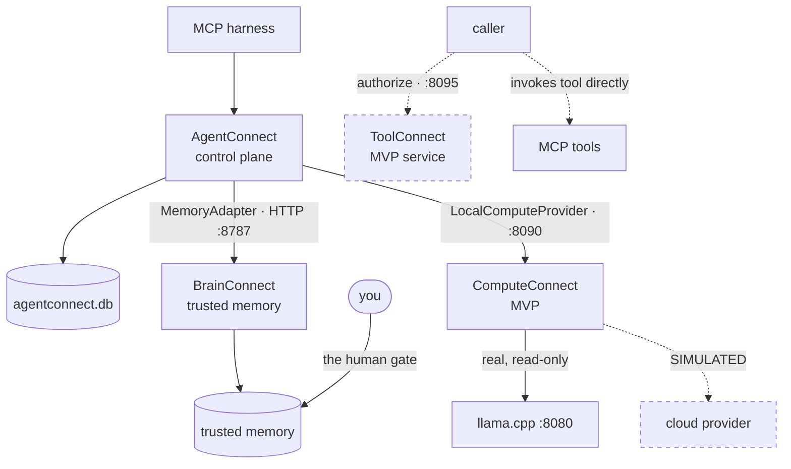

# Architecture

How the Connect products interact. Diagrams are rendered with Mermaid.

Throughout, **solid arrows are paths exercised in code over a real transport this cycle.**
Dashed arrows are bindings that exist but were exercised only at an API surface, or that are
wired programmatically without a declaration surface. That distinction is load-bearing.

---

## The pieces

| Product | Owns | Delegates | Maturity |
|---|---|---|---|
| **AgentConnect** | Task/artifact/decision/review/handoff ledger, routing, model tiering, worker runtime, workspaces and scoped tokens, audit. Both cross-product contracts. | Durable workflows to Temporal, issues to Linear, protocol to the official MCP SDK, inference to whatever implements `LocalComputeProvider` | Release candidate |
| **BrainConnect** | Trust, provenance, scope, promotion and supersession of claims. The human gate. | Search sophistication to a pluggable retrieval backend; secret and injection detection to third-party engines | Release candidate |
| **ComputeConnect** | Compute-provider registry, placement policy, health, execution metadata, structural privacy filtering | Inference itself — it never loads a tensor; engine lifecycle stays with the engine | MVP (heterogeneity unproven) |
| **ToolConnect** | Protocol-neutral tool registry, asserted governance metadata, policy decisions, health, authorization records, audit | Tool description and transport to MCP; in-path proxying to existing gateways | MVP service |

The division is deliberate. **AgentConnect controls access; BrainConnect controls trust.**
Neither is allowed to do the other's job. A task reaching `complete` in AgentConnect never
promotes a claim in BrainConnect, and no BrainConnect status ever authorises an agent to act.

The same discipline governs the newer products. **ComputeConnect decides where work runs, not
how it is computed.** **ToolConnect decides whether a call is permitted, and does not carry the
call** — and where a memory layer may degrade to permissive when unavailable, ToolConnect's
authorization fails closed.

### The contracts

Cross-product surface is expressed as an interface in `agentconnect-core`, never as shared code:

- **`MemoryAdapter`** — how the control plane reaches a memory layer. It is registered in
  `agentconnect.core.bootstrap` under the service name `brainconnect` (env `BRAINCONNECT_URL`,
  token `BRAINCONNECT_TOKEN`, default `http://localhost:8787`), with `wikibrain` kept as a legacy
  alias to the same adapter. `origin_actor_type="system"` is mapped to the ledger's `"tool"`.
- **`LocalComputeProvider`** — an abstract base in `agentconnect.core.local_compute`, with
  `HttpLocalComputeProvider` as the shipped client. ComputeConnect is the engine-side manager that
  conforms to it, carrying amendments CA-1 (privacy default-deny) and CA-3 (`run_id` identity).

There is **no shared interface for tool governance.** ToolConnect defines its own HTTP surface,
documented in its `docs/SERVICE.md` and pinned by `docs/AGENTCONNECT_CONTRACT.md`. AgentConnect
does not yet ship a client for it.

There is no shared package and no monorepo. Separate repositories, explicit interfaces.

---

## Standalone deployments

Every product is designed standalone-first and runs alone today.

### AgentConnect alone ✅

The agent works inside its own harness, but durable work must enter the ledger. A managed agent
session **cannot complete its own task** — the operator closes the loop. Verified this cycle
driving a real `claude -p` through task → launch → shell → artifact → review → audit → complete,
including the refusal of a self-complete inside the managed session.

**Boundary:** AgentConnect is a compliance and control layer, *not* a security sandbox. The HTTP
API's historical authorization/completion bypass was fixed at `a07df7f` and **stays fixed** under
an independent retest. See [COMPATIBILITY.md](COMPATIBILITY.md#known-gaps).

### BrainConnect alone ✅

Everything captured lands `pending`; it becomes trusted memory only when a human promotes it. The
`brainconnect` command makes zero model calls; only the separate `brainconnect-librarian` uses a
model, and only to draft. **Retrieval can never widen trust** — the backend nominates rows by id;
the ledger answers for status, scope, and confidence.

### ComputeConnect alone ✅ (MVP)

The runtime is real: six `LocalComputeProvider` routes, an OpenAI-compatible layer, streaming with
mid-stream cancel, and structural default-deny privacy filtering. **The heterogeneity premise is
unproven** — the only real provider on this host is the local llama.cpp engine; the second is
simulated (drawn dashed for exactly that reason).

### ToolConnect alone ✅ (MVP service)

Note the shape: the **decision arrow and the call arrow are separate.** ToolConnect answers whether
a call is permitted; the caller invokes the tool itself. There is no `invoke()` anywhere — a test
asserts its absence. Authorization **fails closed**; `serve` refuses to start without a parseable
policy.

---

## Two-product integration

### AgentConnect + BrainConnect over HTTP ✅ works today

The adapter, the environment variable, the default URL, and **now the server** all exist. Verified
in Scenario 2 over real HTTP with a bearer token: capture (with the `system`→`tool` actor mapping),
a prompt-injection candidate **quarantined at capture**, a promotion blocked by safety raising
`MemorySafetyRefused` with a full nested envelope, a human promotion, and the resulting trusted
claim recalled into a task context pack.

The trust gradient is one-way and asymmetric by design:

- **Capture is write-only.** Workers — including low-tier or remote ones — may contribute findings.
- **Recall is manager-only.** A worker can add to memory and never read privileged memory back out.
- **Re-injection is mediated** through AgentConnect's classify-and-redact pass.

**The rule every consumer must obey:** `trusted: true` is the authority signal.
`status: "promoted"` is **not**. A promoted claim in an open contradiction comes back `promoted`
*and* untrusted. A missing `trusted` means untrusted — never infer it from status. Independently,
**trusted is not the same as safe to expose:** safety engines mask, withhold, and flag; no safety
engine may ever *set* `trusted`. Safety subtracts, it never vouches.

> One honest gap remains in this seam: there is no way to configure the memory adapter's bearer
> token from the AgentConnect worker side in every path, so a token-protected recall surfaces its
> `MemoryAuthorizationError` as a **non-fatal warning** rather than succeeding. Capture is
> unaffected. Recorded in the integration evidence.

### AgentConnect + ComputeConnect ✅ works today

Verified in Scenario 3: health and inventory, local estimate, cloud-only refused when no tier and
when `repo_sensitive`, cloud-only placed only for `public`, a real generation run, and a streamed
1024-token run **cancelled mid-stream** (`finish_reason=cancelled`).

### AgentConnect + ToolConnect ⚠️ API-level only

Drawn dashed because the binding was exercised at ToolConnect's decision API, **not** through a
shipped AgentConnect client. Verified in Scenario 4: real MCP stdio ingest of a three-tool server,
authorize-denies-before-assertion then permit/forbid after, fail-closed on a duplicate identity and
on post-assertion drift (invocability revoked), and a verifiable audit chain. What is missing is a
first-class AgentConnect ToolConnect client.

---

## Complete ecosystem composition ✅ verified

This is not a diagram of an unbuilt system. Scenario 5 composed all four products end-to-end on
2026-07-12.

What Scenario 5 actually proved, honestly:

- **AgentConnect → BrainConnect.** A trusted claim was recalled into an AgentConnect context pack
  (`authority_trusted=true`), and a new candidate was captured back. Real HTTP. Solid.
- **AgentConnect → ComputeConnect.** A subtask was placed on the real `qwen3-30b-a3b` engine via a
  local-manager worker, with route explanation and worker output recorded in the ledger. Solid —
  but the *cloud alternative it could route to is simulated*, so heterogeneity is still unproven.
- **Caller → ToolConnect.** A decision was issued (`allow`) and its outcome recorded. Dashed,
  because the caller wired ToolConnect's API directly rather than through an AgentConnect client.
- The whole thing ran inside a managed session, the audit **passed**, and the operator — not the
  agent — marked the task `succeeded`.

The dashed edges become solid when a shipped AgentConnect ToolConnect client exists and when a
real second compute provider replaces the simulated one.
