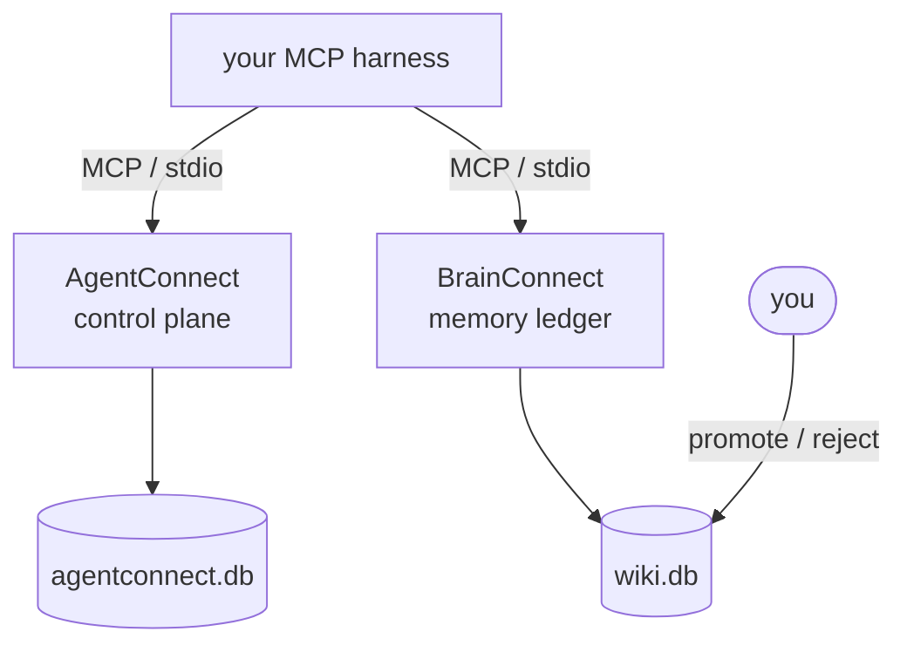

# Combined installation

Running more than one Connect product together.

| | Products |
|---|---|
| **Available** | AgentConnect, BrainConnect |
| **Design-stage, not installable** | ComputeConnect, ToolConnect |

A combined install is therefore a **two-product** install. Instructions for a four-product
ecosystem will be written when ComputeConnect and ToolConnect have runnable releases, and not
one moment earlier.

Read this before you start: **the two products compose in two different ways, and only one of
them works today.** Choosing the wrong one costs you an afternoon discovering that a
documented default points at a server nobody wrote.

---

## The two topologies

### Topology A — both as MCP servers behind one harness ✅ works today

Your agent harness (Claude Code, Codex, Cursor, opencode, …) connects to *both* MCP servers
independently. The agent gets AgentConnect's tools and BrainConnect's `brain_*` tools side by
side. The products never talk to each other; the harness is the only thing that touches both.



This requires no HTTP, no shared port, and no integration code. It is the recommended
combined install.

**Trade-off:** the coupling lives in the harness's head. Nothing forces an agent to record a
finding in BrainConnect just because it completed a task in AgentConnect. You get two good
tools, not one system.

### Topology B — AgentConnect calls BrainConnect through its memory adapter ⛔ blocked

AgentConnect's core registers a BrainConnect memory adapter in
`agentconnect/core/bootstrap.py`:

```python
"wikibrain": (WikiBrainMemoryAdapter, "WIKIBRAIN_URL", "http://localhost:8787")
```

Point `WIKIBRAIN_URL` at a BrainConnect REST service and the control plane can capture and
recall memory on its own. That is the intended architecture.

**It does not work, because BrainConnect has no HTTP server.** There is no `wiki serve`.
Nothing listens on `:8787`. The repository contains no `uvicorn`, `FastAPI`, or `flask`
import anywhere. `wiki serve` is a tracked, deferred follow-up.

The cross-repo integration test stands in for the missing server with an in-process transport
into `wiki.api`. That test drives a real ledger, real promotion, and the real trust filter —
so the semantics are genuinely verified. But there is no wire plumbing.

> **A green integration suite means the semantics agree, not that the network path exists.**

Do not configure `WIKIBRAIN_URL` and expect memory to work. It will fail at the socket.

---

## Installing both (Topology A)

### Prerequisites

**Python 3.11 or newer.** AgentConnect requires ≥ 3.10 and BrainConnect requires ≥ 3.11, so
the effective floor for a combined install is the higher of the two. See
[COMPATIBILITY.md](COMPATIBILITY.md#python-version-floor).

### Use separate virtual environments

Install each product into its own venv. They are separate repositories with separate
dependency sets, separate licenses, and separate Python floors. Sharing a venv buys you
nothing and risks resolving one product's constraints against the other's.

It also protects BrainConnect's central guarantee. The `wiki` command makes zero model calls;
the model-bearing `wiki-librarian` is a deliberately separate process. Mixing an inference
stack into the same environment blurs a line the product works hard to draw.

### AgentConnect

```bash
git clone https://github.com/Judgernaut777/AgentConnect
cd AgentConnect
python3 -m venv .venv && source .venv/bin/activate
pip install -e packages/agentconnect-core -e packages/agentconnect-cli
export AGENTCONNECT_DB_PATH=/srv/agentconnect/agentconnect.db
agentconnect --help
deactivate
```

> **Do not enable the HTTP API** (`agentconnect-api`) for managed-agent access. An
> authorization and completion bypass is open at the time of writing. See
> [COMPATIBILITY.md](COMPATIBILITY.md#known-gaps). Topology A does not need it.

### BrainConnect

```bash
git clone https://github.com/Judgernaut777/BrainConnect
cd BrainConnect
cp config.example.toml config.toml
python3 -m venv .venv
.venv/bin/python -m pip install -e ./cli
.venv/bin/wiki init
```

### Register both with your harness

Each product exposes an MCP server. Register them as two separate entries, using absolute
paths into each venv so the harness does not depend on which environment is active.

- **AgentConnect:** the `agentconnect-router` console script (from
  `packages/agentconnect-router`), or `agentconnect-mcp` (from `packages/agentconnect-mcp`).
  Both are separate installs from the CLI above.
- **BrainConnect:** `wiki mcp serve`.

> **Serve BrainConnect without `--review`.** The `--review` flag exposes `brain_pending`,
> `brain_promote`, and `brain_reject` — the human gate. Handing those to an agent defeats the
> entire trust model. Promote from your own terminal.

---

## Environment variables

| Variable | Product | Purpose |
|---|---|---|
| `AGENTCONNECT_DB_PATH` | AgentConnect | Path to the operator ledger database |
| `WIKIBRAIN_URL` | AgentConnect | Base URL of the BrainConnect REST service. **Leave unset** — no such service exists (Topology B). |
| `WIKIBRAIN_DB` | BrainConnect | Override the ledger database path. Set this in tests and scripts. |

### The `WIKIBRAIN_DB` hazard

`Repo.open()` runs forward schema migrations on **every** open, including the one the MCP
server performs at launch. The database lives at an absolute path from `config.toml`, so
passing a temporary repo root does **not** isolate it. Any test, script, or verification run
that opens a repo will migrate your live `~/.wiki-brain/wiki.db` unless you set
`WIKIBRAIN_DB=/tmp/scratch.db` first.

### Ports

`WIKIBRAIN_URL` defaults to `http://localhost:8787`, and AgentConnect's own compliance
documentation uses `:8787` as the example value for `AGENTCONNECT_API_URL`. Two products must
not share a port. See the [port registry](COMPATIBILITY.md#provisional-port-registry) before
either becomes load-bearing.

---

## What "combined" does not buy you

- **No automatic capture.** AgentConnect will not write agent findings into BrainConnect for
  you. Under Topology A the agent must call `brain_capture` itself.
- **No shared trust model.** AgentConnect's task states and BrainConnect's `trusted` flag are
  unrelated. A completed task is not a promoted claim, and never becomes one without a human.
- **No shared database.** Two SQLite files, two lifecycles, two backup jobs.

If you want one system rather than two tools, Topology B is the design that delivers it — and
it is waiting on `wiki serve`.
